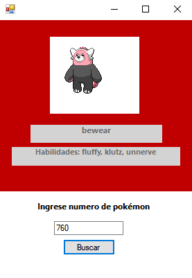

# Pokédex C#

*Esta es una aplicación de Windows Forms que te permite buscar información sobre diferentes Pokémon utilizando la PokeAPI. Utiliza la biblioteca JSON.NET (también conocida como Newtonsoft.Json) para manejar la serialización y deserialización de datos JSON.*

## Características

> - *Permite buscar y mostrar información sobre un Pokémon específico.*
> - *Muestra el nombre, habilidades y una imagen del Pokémon buscado.*

## Capturas de pantalla

   

---
## Instalación

1. Clona o descarga el repositorio de la aplicación.
2. Abre el proyecto en Microsoft Visual Studio.
3. Restaura los paquetes NuGet requeridos:
   - Abre el Administrador de paquetes NuGet en Microsoft Visual Studio (`Herramientas -> Administrador de paquetes NuGet -> Administrar paquetes NuGet para la solución`).
   - Busca "Newtonsoft.Json" en la pestaña "Examinar" y selecciona la biblioteca JSON.NET de Newtonsoft.
   - Haz clic en el botón "Instalar" para agregar la biblioteca a tu proyecto.
 4. Compila y ejecuta la aplicación.

---
## Uso

1. *Ingresa el número del Pokémon que deseas buscar en el cuadro de texto.*
2. *Haz clic en el botón "Buscar".*
3. *El nombre y las habilidades del Pokémon se mostrarán en los cuadros de texto correspondientes.*
4. *La imagen del Pokémon se mostrará en el PictureBox.*

---
## Tecnologías utilizadas

- *C# .NET Framework*
- *Windows Forms*
- *Newtonsoft.Json (JSON.NET)*
- *HttpClient*

---

### Licencia

*Este proyecto está bajo la Licencia MIT.*

 

